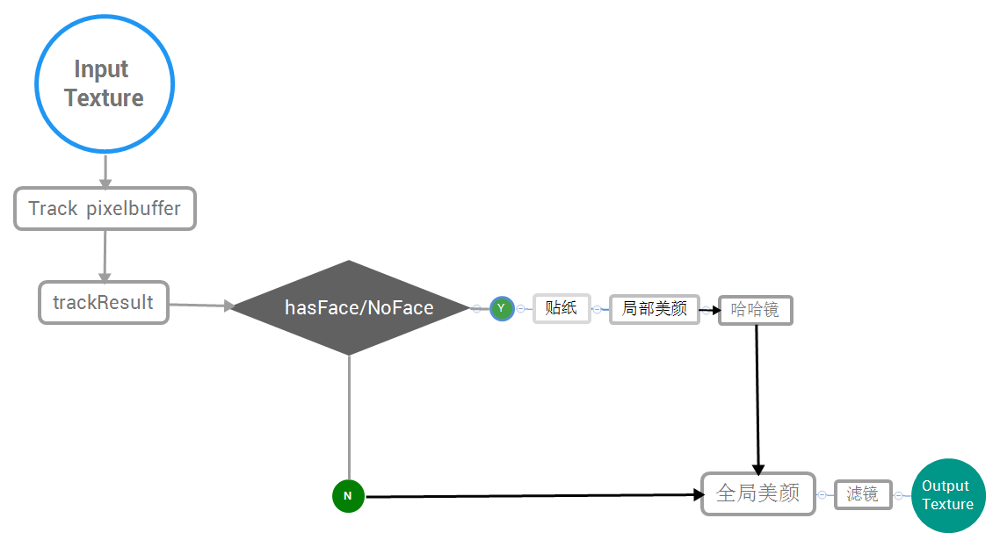
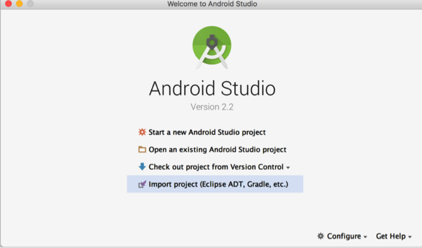
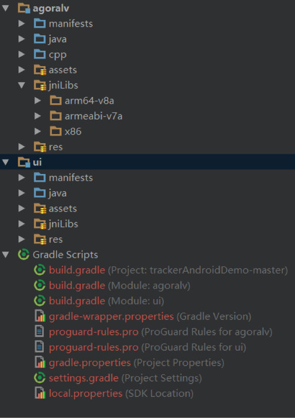
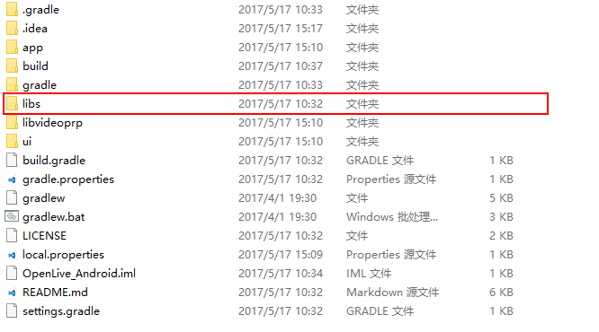
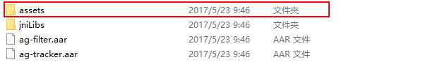
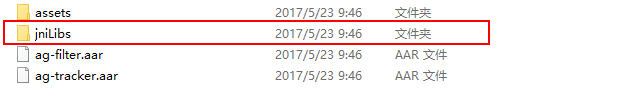

# Agora Face Tracker SDK for Android Quick Integration Guide

Agora Face Tracker SDK includes the following features：
- Facial key points and face position detecting and tracking on static images
- Real-time detecting and tracking of 68 key points on face ( single face /multiple faces)
- Real-time filters, such as beautification and magic mirror
- Parameter estimation on face pose
- Fun 2D stickers

Optimized for hardware occupancy, performance precision and efficiency of algorithm , the SDK can be used for live streaming on mobile devices, providing features like beautification camera, filter camera, fun sticker and simulation makeup, etc. 味贴纸，虚拟美妆等应用场景。

## Flow diagram



The following sections describe how to integrate the demo into your application, with some specific steps provided to help you use the demo.

## Demo Quick Start Guide
#### Environment Preparation

Software

    * Android SDK API Level> = 15
    * Android Studio 2.0 or later

Hardware

    * Real mobile devices with voice and video functions
    * Android 4.1 or later

#### Complied Code Samples
1. 1.	Select Import project (Eclipse ADT, Gradle, etc.) in Android Studio 
   

2. With Android studio's Import tools, import the following projects:
  ```
  agora_rtc_sdk\android\sample\trackerAndroidDemo-master
  ```

3. Your code should show the following directory structure

  

4. Click __Run__ and you should see refined pictures on your screen. See the following screenshots as an example:

 |  |

## Integration Steps

#### Step 1: Obtain aar package

  Obtain __ag-filter.aar__ and __ag-tracker.aar__ from the SDK folder.

#### Step 2: Prepare for the compilation environment
* Android SDK API Level> = 15
* Android studio 2.0 or later
    * Tested real devices 

#### Step 3: Import required packages from the SDK

1.   Create a libs folder under the project, and then import aar package obtained from “step 1” into this libs folder.
     
2.   Import aar package to __build.gradle__ of your project

            ```
            repositories {
              flatDir {
                  dirs '../libs'
              }
            }
           
            dependencies {
              compile(name: 'ag-filter', ext: 'aar')
              compile(name: 'ag-tracker', ext: 'aar')
            }
            ```

3.   Copy __assets__ file under the SDK folder to your project folder
           

4.   Copy jniLibs files under the SDK folder to your project folder
           

5.   Add the following permissions to AndroidManisfest.xml file to make sure the SDK runs stably:

  ```
  <uses-permission android:name="android.permission.INTERNET" />
<uses-permission android:name="android.permission.WRITE_EXTERNAL_STORAG"/>
<uses-permission android:name="android.permission.RECORD_AUDIO" />
<uses-permission android:name="android.permission.CAMERA" />
<uses-permission android:name="android.permission.WAKE_LOCK" />
<uses-permission android:name="android.permission.ACCESS_NETWORK_STATE" />
<uses-permission android:name="android.permission.READ_PHONE_STATE" />
<uses-permission android:name="android.permission.ACCESS_WIFI_STATE" />
<uses-permission android:name="android.permission.MODIFY_AUDIO_SETTINGS" />
<uses-permission android:name="android.permission.WRITE_EXTERNAL_STORAGE" />
<uses-permission android:name="android.permission.RECORD_AUDIO" />  
<uses-permission android:name="android.permission.MOUNT_UNMOUNT_FILESYSTEMS" />
  ```

#### Step 4: Configure stickers

  Configure the stickers if necessary. Sticker packages are in the sticker folder,  with  config.json file included in every set of sticker files. The sticker file includes audio file, item parameter and some other information. See below for a sample structure: 
  ```
    |--[sticker_1] （Sticker 1）
  |   |--config.json （Sticker configuration file）
  |   |--[audio]（Audio file）
  |   |--[preview]（Sticker preview）
  |   |--[item_1]（Sticker item 1）
  |   |   |--[frame_1]（Sticker frame 1）
  |   |   |--[frame_2]（Sticker frame 2）
  |   |   |--...
  |   |   |--[frame_n]（Sticker frame n）
  |   |--[item_2]（Sticker frame file 2）
  |   |--...
  |   |--[item_n]（Sticker frame file n）
  |--[sticker_2]（Sticker 2）
  |--...
  |--[sticker_n]（Sticker n）
  |—StickerConfig.json（Sticker configuration file）
  ```
  The application displays relevant stickers and icons by reading StickerConfig.json under the sticker file.

  __The following tables list the parameters of a Json file:__


  StickerConfig.json

| Parameter name       | Definition                                |
| ---------- | --------------------------------- |
| name       | Name of the stickers                 |
| dir        | Name of the sticker folder                       |
| category   | Categories of sticker types                   |
| thumb      | File name of the sticker icon( under the same folder as audio file)              |
| voiced     | true: with voice  false: no voice） |
| downloaded | Indicates whether it has been downloaded or not. If not, the application can download it and then change the status here.  |

  config.json

| Parameter name               | Definition                |
| ----------------- | ----------------- |
| type              | Types of the position the sticker will be displayed (e.g., face, full screen)  |
| facePos           | Where the sticker goes on the face          |
| scaleWidthOffset  | Scale ratio of the sticker width          |
| scaleHeightOffset | Scale ratio of the sticker height        |
| scaleXOffset      | Offset coefficient of the sticker moving horizontally on face     |
| scaleYOffset      | coefficient of the sticker moving vertically on face     |
| alignPos          | Alignment item parameter          |
| alignX            | Offset coefficient of the edge moving horizontally     |
| alignY            | Offset coefficient of the edge moving vertically          |
| frameFolder       | Sticker resource folder ( including a set of picture frames) |
| frameNum          | Frame numbers（a set of sequence frames makes an animation） |
| frameDuration     | Interval of every frame（in second）          |
| frameWidth        | Width of image              |
| frameHeight       | Height of image             |
| trigerType        | Trigger condition; by default it is set to 0; always displaying     |


#### Step 5:  Call APIs
Use the APIs to implement the functions (see android-api document for more details). 
The following example of __AGTrackerWrapper__ class illustrates how to implement functions like stickers, beautification and filters. 

  1. 1.	Initialize in Activity

```java
  // Initializing AGTrackerWrapper in Activity
  // Import Android context and Camera type (front or rear cameras), e.g Camera.CameraInfo.CAMERA_FACING_FRONT
  AGTrackerWrapper = new AGTrackerWrapper(this, mCamera.mCurrentCameraId);
  AGTrackerWrapper.onCreate(this);
```

  2. Import customized controls in Activity

  ```
  <com.agora.ui.AGControlView
    android:id="@+id/camera_control_view"
    android:layout_height="match_parent"
    android:layout_width="match_parent"/>
  ```

  3. Call AGTrackerManager method

```java
  public OnViewEventListener initUIEventListener(final UIClickListener uiClickListener) {
    OnViewEventListener eventListener = new OnViewEventListener() {
        @Override
        public void onTakeShutter() {
            uiClickListener.onTakeShutter();
        }

        //switch cameras
        @Override
        public void onSwitchCamera() {
            uiClickListener.onSwitchCamera();
        }

        //switch filters
        @Override
        public void onFilterChanged(AGFilterType filterType) {
            getAGTrackerManager().switchFilter(filterType);
        }

        //switch stickers
        @Override
        public void onStickerChanged(StickerConfig item) {
            getAGTrackerManager().switchSticker(item);
        }

        //eye magnifying/face slimming on/off
        @Override
        public void onSwitchBeauty(boolean enable) {
            getAGTrackerManager().setBeautyEnabled(enable);
        }
        //beautification on/off
        @Override
        public void onSwitchBeautyFace(boolean enable) {
            getAGTrackerManager().setBeautyFaceEnabled(enable);
        }
        //trace points
        @Override
        public void onSwitchDrawPoints() {
            getAGTrackerManager().switchDrawPoints();
        }

        //switch magic mirror
        @Override
        public void onDistortionChanged(AGFilterType filterType) {
            getAGTrackerManager().switchDistortion(filterType);

        }

        @Override
        public void onAdjustFaceBeauty(int type, float param) {
            switch (type) {
                //eye magnifying adjust
                case AGControlView.BEAUTY_BIG_EYE_TYPE:
                    getAGTrackerManager().adjustFaceBigEyeScale(param);
                    break;
                //face slimming adjust
                case AGControlView.BEAUTY_THIN_FACE_TYPE:
                    getAGTrackerManager().adjustFaceThinFaceScale(param);
                    break;
            }

        }
        //adjust beautification
        @Override
        public void onFaceBeautyLevel(float level) {
            getAGTrackerManager().adjustBeauty(level);
        }    
```


#### Notes


-  	Define the supported CPU architectures in __build.gradle__ file. 
   	Add dependencies and properties configuration in __build.gradle__ file of the Module. 

    ```
    android {
              defaultConfig {
                ndk {
                  //Set the supported SO libraries architecture
                  abiFilters 'armeabi' //, 'x86', 'armeabi-v7a', 'x86_64', 'arm64-v8a'
                }
              }
          }
    ```

- Avoid confusing operations with Agora's. Add the following settings to __Proguard__ file:

  - ```java
    -dontwarn com.agora.**
    -keep public class com.agora.**{*;}
    ```

